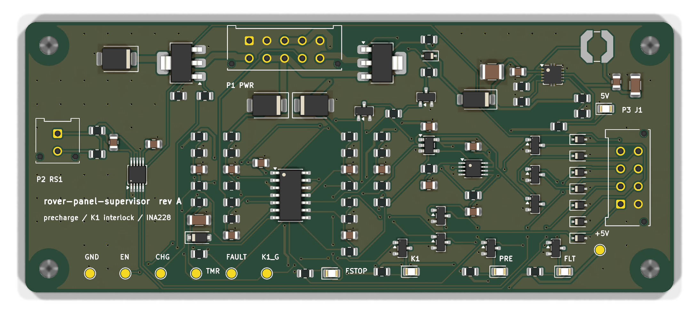

# rover-panel-pcb 

The PCB was missing. It sits on
four standoffs on the panel plate, between the shunt and the signal
connector, and does three jobs:

- **precharge** — it switches the pack through the panel's 22 Ω resistor `R1`
  into the ESC bank, and holds contactor `K1` open until the switched bus
  reaches ~90 % of the pack
- **interlock** — `K1`'s coil is energised through the E-stop loop *and* this
  board, so the board can open `K1` but nothing on it can close `K1` past an
  open E-stop
- **current sense** — an INA228 on the panel's 0.75 mΩ shunt `RS1`, reported
  over I2C



It replaces two of the panel's bought parts — `K2`, an automotive precharge
relay, and `A1`, an INA228 breakout on standoffs — and it answers two of the
panel's open questions: *"precharge is sized by hand and is not in any check"*
and *"is the E-stop hard-wired in series with the contactor coil?"*

The one claim the board is built to prove:

> **K1 cannot close unless the E-stop loop is closed AND the host has raised a
> fresh ARM edge AND the switched bus has reached the precharge threshold** —
> and that is hardware, checked against the exported netlist, not a promise
> made by firmware. There is no firmware.

---

## 1. How the interlock works

The logic is four comparators, one AND gate and one D flip-flop. Every node
that feeds the interlock is an open-collector output pulled up **to EN, not to
5 V** — so the instant the board disarms, every one of them falls with it.

| signal | made by | means |
|---|---|---|
| `ESTOP_OK` | U3C: the *far* side of the E-stop loop (`COIL_POS`) above 13.7 V | the mushroom switch is closed |
| `ARM` | U3D: host line above 1.37 V, 100 k pull-down | the host asked; an unplugged harness reads as *no* |
| `CLR#` | U4: `ARM AND ESTOP_OK` | either one dropping clears the latch immediately |
| `EN` | U5 (74LVC1G74) Q, set only on a **rising edge** of `ARM` delayed 10 ms | armed |
| `CHG` | U3A: switched bus / always-on bus **below** the threshold | precharging |
| `FAULT` | U3B: `CHG` has been high longer than the timer (≥ 1.68 s) | the bus is not charging — latches |
| `K1_G` | `EN`, pulled low by `CHG` (Q2) or `FAULT` (Q3), 1 ms RC | close the contactor |
| `PRE_G` | `EN`, pulled low by `FAULT` (Q4) | precharge switch on |

The flip-flop is there for one reason. With a plain AND gate, releasing the
E-stop while the host is still asserting `ARM` would re-energise the drive
motors on its own. With the latch, **an E-stop release does nothing until the
host drops `ARM` and raises it again.** That is what competition rules mean by
a deliberate restart, and it is scenario 5 in the simulation below.

The K1 coil path is:

```
+24 V -> P1.8 -> J1 -> E-stop -> J1 -> P1.3 -> P1.4 -> K1 coil -> P1.6 -> Q1 -> GND
```

`Q1` is on the low side. It can only *interrupt* that loop.

## 2. The design numbers

### Precharge threshold: a window, not a number

The comparator does not measure "90 % of 24 V". It compares two dividers —
the switched bus against the always-on bus — so it holds from a 21 V cutoff
to a 29.4 V full pack. Its threshold still moves, for three reasons, and
`calcs.pre_ratio_window()` takes every corner of all three:

- the hysteresis resistor injects a fixed 5 V into a divider of a *varying*
  pack, so the trip point shifts with pack voltage
- the four ratio resistors. They are 0.1 % parts because with 1 % parts the highest
  corner trips at 94.75 %, which is **above** the 94.50 % the bus can reach. The
  board would fault on a low pack.
- the LM339's 5 mV offset plus its 250 nA bias current through each divider

```
precharge threshold window     88.34 .. 91.74 % of pack
bus can reach through R1       94.50 % at 21 V, with 50 mA of ESC idle draw
```

**The ESC idle draw is the constraint.** The bus charges towards
`V − I_idle × R1`, not towards `V`. At a 21 V pack and 50 mA of idle current,
R1 takes 1.1 V off the target, and a threshold set at the textbook 95 % would
never be reached — the board would fault on every power-up. The 50 mA is
assumed and is the first thing to measure (§6).

### The fault timer has to outlast a slow precharge

```
precharge time, nominal        0.41 s    (6 mF, 25.9 V)
precharge time, worst          0.73 s    (9 mF, 21 V, highest threshold)
fault timer                    1.68 / 2.36 / 2.66 s   (min / nom / max)
```

The minimum assumes the 10 µF X7R timing capacitor has lost 25 % to tolerance
and DC bias, and that the comparator's full bias current is helping to charge
it. That still leaves 2.3× margin over the slowest legitimate precharge. The
maximum is bounded too: into a dead short, `R1` sees 41 W, inside its 50 W
continuous rating, for as long as the timer takes.

### The panel's supply budget

The panel's `params.py` reserves a supply for the board: a 2 A time-lag fuse on
`DIN2-203`, 18 AWG, 0.2 A continuous and a 2.5 A peak. The panel's
`sizing.py` sizes the wiring from those numbers, and this board checks that
its worst case fits inside them. Neither side can quietly outgrow the other.

```
24 V draw                      76 mA continuous (70 mA of it is K1's hold current)
                               2.17 A worst instant: K1 pull-in while precharge still conducts
```

### Everything else

| check | result |
|---|---|
| INA228 full scale at `ADCRANGE = 0` | 218 A, 0.42 mA per count, `SHUNT_CAL` = 2803 |
| current error at 10 A | 0.31 % (shunt 0.25 %, INA228 gain, offset, filter bias) |
| input TVS SM6T36A | stands off 30.8 V > 29.4 V; clamps 49.9 V < 60 V (every FET on the 24 V side) |
| K1 FET gate drive | 4.85 V on a 5 V −2 % rail, ≥ the 4.5 V its RDS(on) is quoted at |
| K1 coil at pack cutoff | 19.8 V ≥ 16 V pickup, after the E-stop loop, the FET and panel wiring |
| precharge FET gate | zener-clamped, ≤ 12.6 V worst case, from 21 V to 29.4 V (fully on, under ±20 V) |
| every LM339 input | inside `VCC − 1.5 V` at a full pack |
| power traces | 1.0 mm vs 0.70 mm IPC-2221 at 2.5 A as if continuous |

### The behaviour, simulated

`test_calcs.py` finishes with a 1 ms-step simulation of the interlock built
from those same thresholds and time constants — nothing retuned for the test:

```
PASS  power-up, ARM low: nothing switches
PASS  ARM with a healthy bus (3 mF): precharge, then K1, no fault  -- K1 closes 0.20 s after ARM, bus at 90.7 %
PASS  ARM with a healthy bus (9 mF): precharge, then K1, no fault  -- K1 closes 0.58 s after ARM, bus at 90.7 %
PASS  ARM into a shorted bus: FAULT latches, precharge stops, K1 never closes  -- fault 2.36 s after ARM
PASS  E-stop opens while K1 is closed: K1 drops within 1 ms
PASS  E-stop released with ARM still high: K1 stays OPEN (needs a new ARM edge)
PASS  ARM cycled after the E-stop reset: precharge and K1 again
PASS  FAULT holds for as long as ARM stays high (a latch, not a retry loop)
PASS  dropping ARM clears FAULT and leaves everything off
```

## 3. What changed from the plan


1. **It had no latch.** The plan's logic was `ARM AND E-STOP AND PRECHARGED`.
   Writing scenario 4 of the simulation showed what that does: release the
   E-stop with `ARM` still high and the motors come back on by themselves.
   The 74LVC1G74 and its 10 ms clock delay are the fix. KiCad 9 ships no
   74LVC1G74 symbol, so it is generated from a pin map in `spec.py`
   (`hw/gen/gen_lib.py`).
2. **The supply fuse is 2 A, not 1 A.** A 1 A fuse passes the board's 76 mA,
   but K1's 2 A pull-in comes through the same fuse.
3. **No 3.3 V rail.** The plan had an LDO for the INA228. Everything runs at
   5 V instead. The INA228's I2C thresholds do not follow its supply, and
   every output to the host is an open-drain FET, so this 5 V board never
   drives a 3.3 V pin. (That INA228 fact is one of the seven items flagged
   `VERIFY`.)
4. **The board is 110 × 46 mm, not ~90 × 55.** The panel set its height:
   25 mm of signal clearance to `K1` above and to the `DIN2` terminals below
   leaves 46 mm. Width was the only direction left to grow.
5. **The buck's pins are not in the 0.3 mm pack-voltage clearance class.** The
   LM5165's own pins are 0.22 mm apart. A 0.3 mm rule for them fails under the
   footprint itself, so the package sets that spacing.
6. **Routing is searched for, not typed.** The plan said to reuse the
   hand-routed generator from `sync-buck`. That generator is still here
   (`kisch.py`, `kipcb.py`, `sexp.py`, `symlib.py`), but 106 parts do not
   route by hand coordinates, so there is a router (§4).

## 4. The layout


Placement is by hand, in `hw/gen/gen_pcb.py`, because placement *is* the
layout design:

- **P1** (power, coil, E-stop loop) is on the top edge, towards `K1` and `R1`.
  Its edge row is ground plus the E-stop-return/coil+ pair, which never has
  to leave the connector. Every net that travels is on the inner row.
- **P2** (the Kelvin pair) is on the left edge, facing `RS1`. The INA228 is
  turned so its inputs face P2 and its I2C and ground pins face open board.
- **P3** (signal to `J1`) is on the right edge, with the ESD diodes in a
  column in the same order as its pins.
- The coil FET and its clamps are left of P1, the precharge switch and buck
  are right of P1, the comparators are in the middle, and the LEDs are along
  the bottom edge where the hatch is.

The copper between the pads comes from `hw/gen/autoroute.py`: a 0.1 mm grid
A* router, two layers, that runs inside KiCad's own Python using numpy.

- Obstacles are painted at each net's own clearance class. The net being
  routed dilates the map by however much wider it is, so a 1 mm coil trace
  keeps 0.3 mm from everything, and a 0.2 mm signal can still leave a
  0.5 mm-pitch IC.
- Fine-pitch pads get straight escape stubs first, along their own axis.
- If a net cannot get out, it is **promoted** and the whole board re-routes
  from scratch with that net earlier in the queue. That is the cheapest
  rip-up-and-retry there is. The current layout routes on the first attempt
  in about 30 s.
- The ground pour is computed after routing, so a union-find walks every
  island, pad, via and track. Any ground pad the pour does not actually reach
  gets a real track to one it does. An island touching a via is not
  "connected" if that via lands in a fenced-off pocket on the other layer.

None of that is trusted. **kicad-cli DRC with schematic parity is the judge.**

```
802 track segments, 1753 mm of track (181 mm on B.Cu, the ground plane)
205 vias, all tented
0 DRC violations, 0 unconnected pads, 0 footprint errors
```

## 5. Verification

### The claim, against the netlist — `hw/gen/check_interlock.py`

This reads the netlist KiCad exported, not the generator, and checks the
structure the simulation assumes:

```
PASS  no on-board path from +24V_IN to COIL_POS, even with every FET on
PASS  COIL_POS touches only P1, a clamp to GND and a >= 100 k sense resistor  -- D6 TVS to ['GND'], R18 100k
PASS  the ONLY thing that can raise K1_G is one resistor from EN  -- pull-ups ['R29->EN']
PASS  K1_G is held low by precharge-in-progress (CHG) and by FAULT  -- Q2(gate CHG), Q3(gate FAULT)
PASS  EN is driven by U5.Q (pin 5) and nothing else
PASS  U5 D and /PRE are tied high: it can only SET on a clock edge
PASS  U5 /CLR = U4 output = ARM AND ESTOP_OK
PASS  VE is a divider off COIL_POS -- the FAR side of the E-stop loop
...                                                          24 checks
```

**And a test for the test.** A structural check that passes on a correct
netlist proves nothing unless it *fails* on a wrong one.
`test_interlock_check.py` applies six plausible mistakes to copies of the
netlist. It requires each one to be caught by the specific check written for
it:

```
PASS  a 100 ohm part bridging +24V_IN straight to the coil  -- caught by: no on-board path from +24V_IN to COIL_POS
PASS  K1_G pull-up taken from +5V instead of EN (E-stop and ARM bypassed)  -- caught by: the ONLY thing that can raise K1_G
PASS  E-stop sense divider moved to the pack side of the loop  -- caught by: VE is a divider off COIL_POS
PASS  flip-flop /CLR tied high (a released E-stop would re-arm by itself)  -- caught by: U5 /CLR = U4 output
PASS  precharge comparator reading the always-on bus twice  -- caught by: VA divides +24V_IN and VS divides SW_SENSE
PASS  FAULT no longer holds K1 off (Q3 gate moved to GND)  -- caught by: K1_G is held low by precharge-in-progress
```

### The layout rules DRC does not know — `hw/gen/check_layout.py`

A board can pass DRC with a 0.3 mm tap carrying the coil current. This script
checks the saved board:

- every power part on each coil, precharge and +24 V net is joined by copper
  at least 1.0 mm wide (union-find over wide tracks only)
- the Kelvin leads are length-matched: 5.3 vs 5.3 mm
- each TVS and decoupling capacitor sits within a stated distance of the pin
  it serves
- every ESD diode is within 15 mm of its P3 pin
- vias are tented
- at most 35 % of track length is on the ground-plane layer

On its first run it failed three times, and only one of those was the board:

1. **The board:** an ESD diode sat 18.5 mm from the P3 pin it protects.
2. **My classification:** reverse-polarity diode D2 was listed as a power
   part, but it only feeds the buck's few mA.
3. **The check itself:** it measured to the SOT-223's far drain pin instead
   of the tab.

Reviewing that output also turned up a problem the check had let through:
its 30 mm limit had let the coil+ clamp sit 28 mm from its pin. D6 now sits
under P1, and the limit is 12 mm.

### The board, measured twice — `hw/gen/check_fit.py`

The plate was drilled from the panel's `params.py`. The board was built from
`panel_interface.json`, which `params.py` wrote. This script reads the
**finished `.kicad_pcb`** back through pcbnew and compares it against
`params.py` imported live, so a stale JSON, a hand-edited board and a moved
plate hole all fail:

```
PASS  panel_interface.json is not stale (equals params.pcb_interface() now)
PASS  H1 at (4.00, 4.00) is where params.py put it  -- params (4, 4) dia 3.2, board dia 3.20
...
PASS  every board hole lands on a plate hole (panel frame)  -- plate [(236.0, 222.0), (236.0, 260.0), (338.0, 222.0), (338.0, 260.0)]
PASS  P1 sits on the top edge, facing its panel device  -- pads centred 4.7 mm from the top edge
PASS  P2 sits on the left edge, facing its panel device  -- pads centred 5.5 mm from the left edge
PASS  P3 sits on the right edge, facing its panel device  -- pads centred 7.5 mm from the right edge
PASS  standoff + board + tallest mated connector fits the height params.py allows  -- 10 + 1.6 + 25 = 36.6 mm <= 36.6 mm
```

## 6. <a name="before-ordering"></a>Before ordering

1. K1's part number: its coil inrush, hold current and pickup voltage, and
   whether it has internal coil suppression. If it does not, add a
   TVS-limited freewheel path.
2. LM5165X: that the EN threshold is 1.2 V, RT to GND selects PFM, and ILIM
   to GND selects the low current limit. R3 and R4 are 0 Ω straps, so either
   choice can change without a respin.
3. LM5165X: that its VIN absolute maximum is 70 V.
4. L1: that its saturation current covers the PFM peak.
5. INA228: that its I2C thresholds are independent of VS.
**Then:** order five boards, put an electronic load on the switched bus and a
capacitor bank in place of the ESCs, and scope `CHG`, `TMR`, `K1_G` and the
bus through every scenario in §2. The template is in
[`measurements/`](measurements/).
